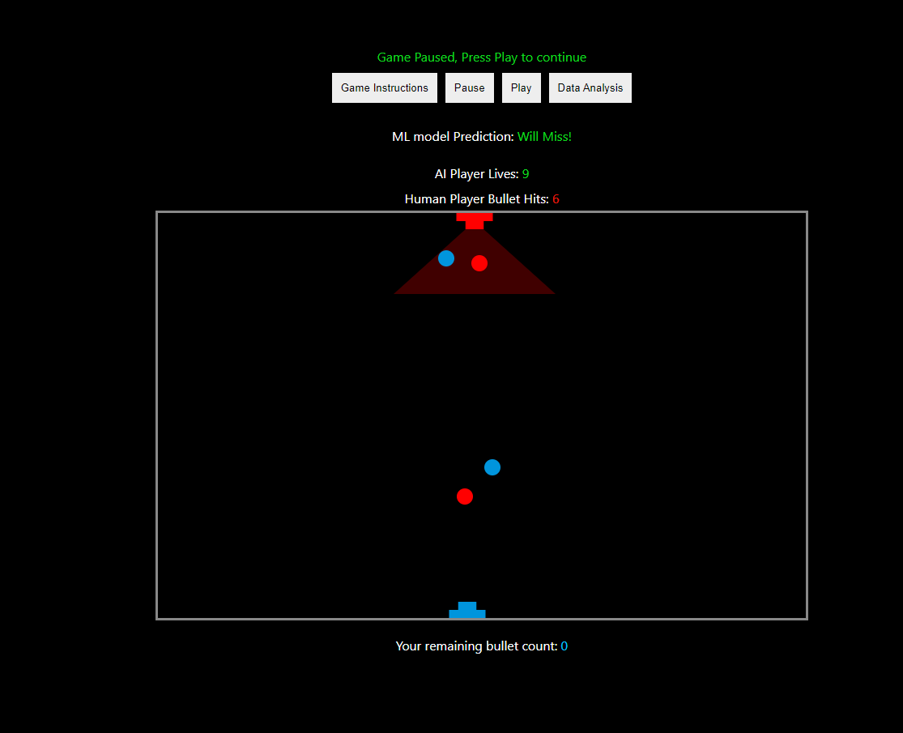
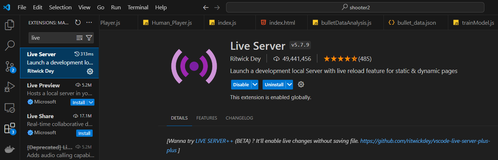

# Shooter 2

Version two of the [shooter](https://github.com/dkbaffour777/shooter) game which implements a trained machine learning model to make predictions which the AI player uses for defense.

Deployed link -

## Installation

- Clone/Download the project
- All external libraries are CDN links in the `index.html` file, so no need for installation but be sure to have an internet connection
- Visual Studio Code is the recommended editor to run the app
- Navigate to extensions and install `Live Server` as shown below
  
- Open the index.html file, right click anywhere in the code and select `Open with Live Server` to run the application

## Usage

- Watch this video for usage demonstration:

## Questions

- 👋 Hi, I’m Daniel Baffour
- 📫 How to reach, email: dkbaffour777career@gmail.com
